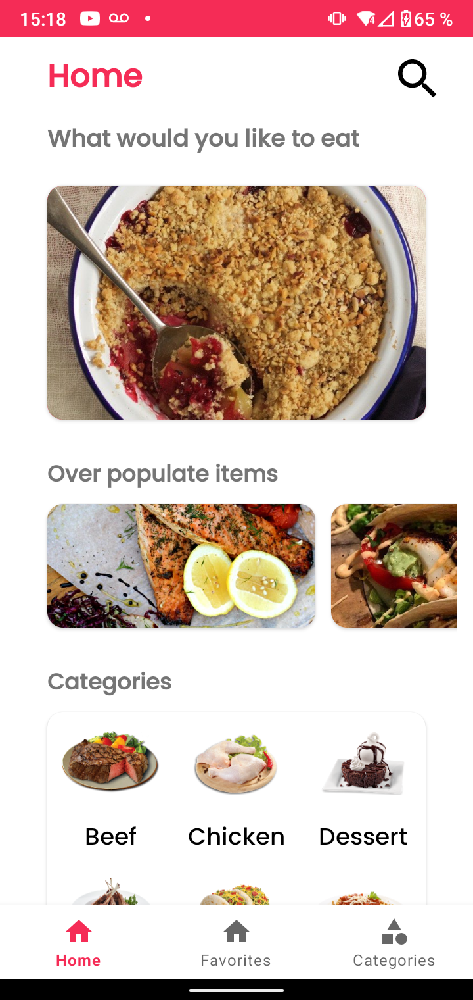
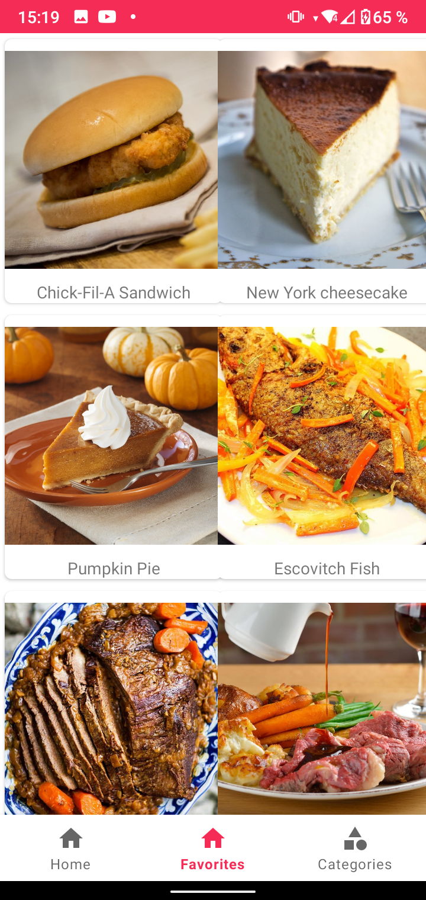
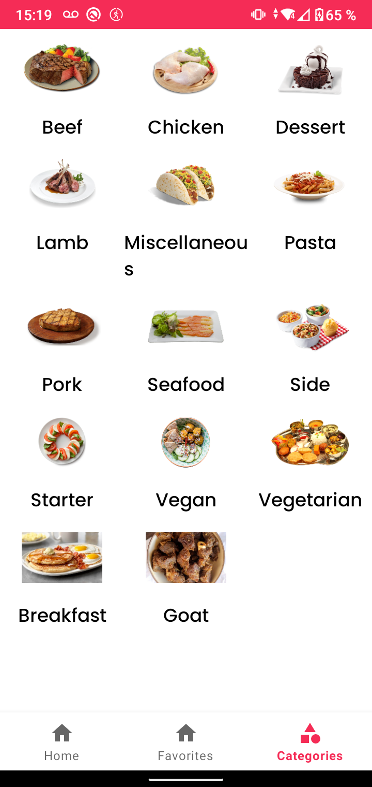
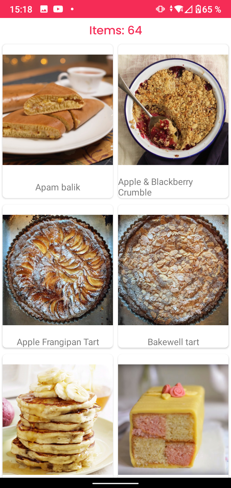
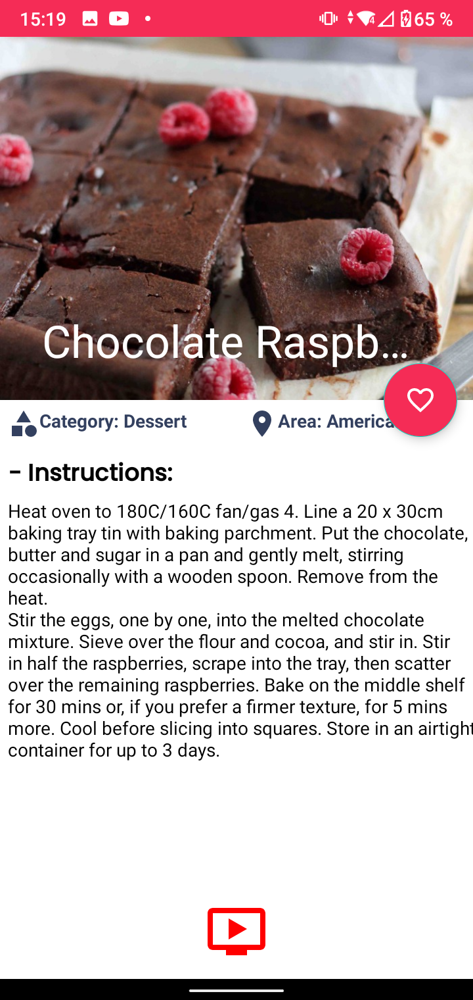

# Food Application

Aplicación para ver una lista de comidas de la api de <b>TheMealDB</b>, también podes guardar tus comidas favoritas para tener acceso a su recete sin conexión 

Elementos utilizados en esta aplicación:
* Retrofit para consumo de APIs con GSON Converter
* RecyclerViews con multiples funciones
* Patron MVVM
* Patron Singleton en Retrofit para evitar duplicación de codigo pesado
* Glide para presentar imagenes en ImageViews con una URL
* Persistencia de datos de internet sin conexión gracias a Room
* Diseño de aplicaciones a partir de una maqueta de Figma
* Intents para iniciar una busqueda en YouTube

|                            Home page                             |                                 Favorites page                                  |
|:-------------------------------------------------------------------------:|:--------------------------------------------------------------------------:|
| |  |

|                            Categories page                             |                                 Category meals                                  |
|:-------------------------------------------------------------------------:|:--------------------------------------------------------------------------:|
| |  |

|                            Meal detail                             |  
|:-------------------------------------------------------------------------:|
| 